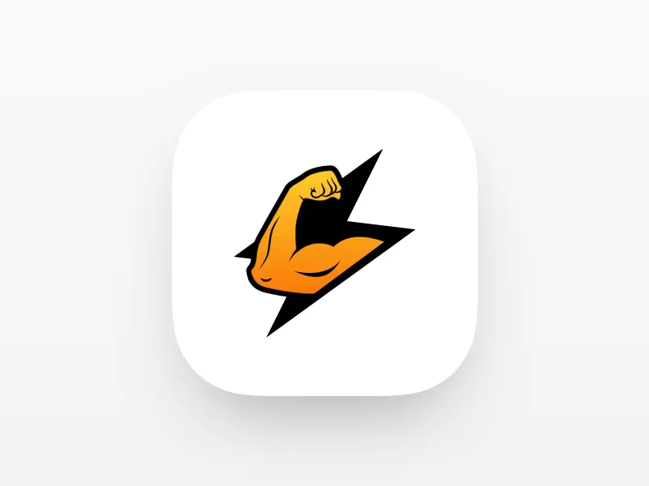

# 🏋️ AI Fitness Tracker

**The Ultimate Smart Workout Companion powered by Computer Vision & Artificial Intelligence.**



This application uses your webcam to analyze your exercise form in real-time, count reps, and provide AI coaching feedback. It features a modern GUI, gamification (XP, Levels), and hands-free voice control.

---

## 🌟 Key Features

### 🧠 Advanced AI & Computer Vision
*   **🤖 Auto-Exercise Recognition (NEW)**: Automatically detects if you are doing Squats, Pushups, or Jumping Jacks without pressing any buttons.
*   **AI Coach**: Real-time form analysis giving feedback like "Go Lower", "Straighten Back".
*   **Rep Quality Score**: Get a grade (0-100%) for every rep based on your form precision.
*   **Face Emotion Detection** 😃/😫: Detects if you are happy or straining during a workout.
*   **Tempo Analysis**: Tracks your eccentric/concentric speed (e.g., "1.5s down / 1.0s up").
*   **Voice Command Control** 🎙️: Completely hands-free navigation.

### 🎮 Gamification
*   **Level System**: Earn XP for every rep. Level up from Bronze to Diamond.
*   **Achievements**: Unlock badges like "Early Bird", "Squat King", "Iron Man".
*   **Streaks**: Maintain a daily workout streak.

### 📊 Exercises Supported
*   💪 **Pushups** (Chest/Triceps)
*   🦵 **Squats** (Legs/Glutes)
*   🏃 **Jumping Jacks** (Cardio)
*   💪 **Bicep Curls** (Arms)
*   🏋️ **Shoulder Press** (Delts)
*   🚶 **Lunges** (Legs)
*   🧘 **Plank** (Core Stability)
*   🦵 **High Knees** (Cardio)
*   🍫 **Crunches** (Abs)

### 🛠️ Utilities
*   **Analytics Dashboard**: Visual graphs of your reps and calories.
*   **BMI Calculator**: Track your body metrics.
*   **PDF Export**: Download session reports.
*   **Localization**: Support for English and Hindi (हिंदी).

---

## 💻 Installation

### Prerequisites
*   Python 3.10 or higher
*   Webcam

### Steps
1.  **Clone the repository**:
    ```bash
    git clone https://github.com/adityarajbisoyi/a4fitness.git
    cd a4fitness
    ```

2.  **Install Dependencies**:
    ```bash
    pip install -r requirements.txt
    ```

---

## 🚀 How to Run

Simply run the main application file:

```bash
python app.py
```

The graphical interface will launch. 
*   **Click "🤖 Auto Detect"** (first card) to try the automatic mode.
*   Or select any specific exercise card to begin.

---

## 🎙️ Voice Commands

You can control the app hands-free! Try saying:

| Command | Action |
| :--- | :--- |
| **"Start Pushups"** | Launches Pushup Module |
| **"Start Squats"** | Launches Squat Module |
| **"Start Planks"** | Launches Plank Timer |
| **"Go Home"** | Returns to Main Menu |
| **"Show History"** | Opens History Tab |
| **"Open Tools"** | Opens Utils Menu |
| **"Stop"** | Stops current activity (in some contexts) |

---

## 📂 Project Structure

*   `app.py`: Main GUI application (CustomTkinter).
*   `auto_detect_module.py`: **Logic for Automatic Exercise Recognition.**
*   `PoseModule.py`: Core logic for MediaPipe Pose estimation.
*   `ai_coach_module.py`: Logic for scoring form and analyzing movement.
*   `face_emotion_module.py`: Face Mesh logic for emotion detection.
*   `voice_control_module.py`: Background thread for speech recognition.
*   `*_module.py`: Individual logic for exercises (e.g., `squat_module.py`).
*   `database.py`: SQLite database management.

---

## 👨‍💻 Developer
**Aditya Raj Bisoyi**

---
*Built with Python, OpenCV, MediaPipe, and CustomTkinter.*
